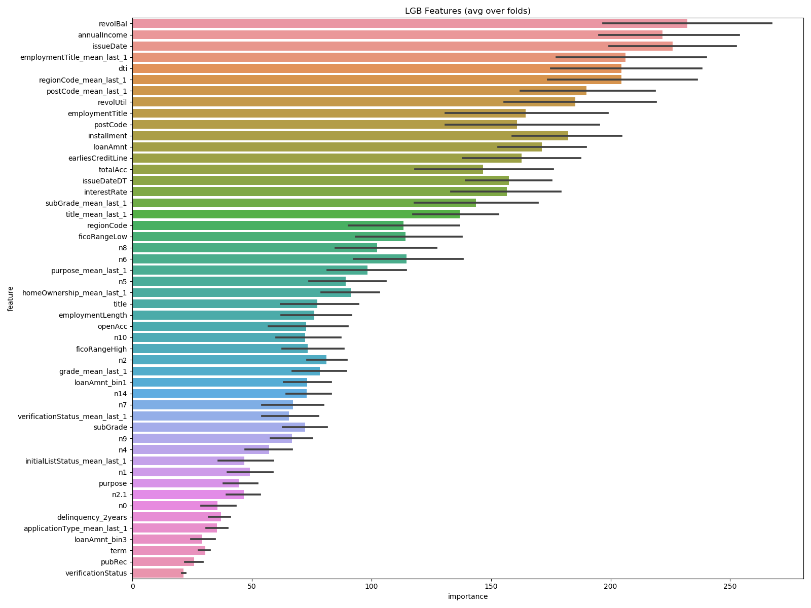

# 贷款违约预测
天池：[零基础入门金融风控-贷款违约预测](https://tianchi.aliyun.com/competition/entrance/531830/forum)
学习资料：[FinancialRiskControl](https://github.com/datawhalechina/team-learning-data-mining/tree/master/FinancialRiskControl)
## 特征

## 模型

### lightgbm

- 基础特征 线下：`lgb_0.8072649999999999.csv` 线上`0.7342`

- 添加 5折cv转化率特征 `0.8074600000000001` 线上 `0.7368`

- 加入多组特征： 线下`0.8074874999999999` 线上`0.7385`
```text
[0.80766875, 0.80690625, 0.80741875, 0.80745, 0.80799375]
train_model_classification cost time:478.3310031890869
0.8074874999999999
```
- 提高类别转化率特征数量：线下`0.8075150000000001` 线上
```text
[0.80770625, 0.80708125, 0.8080625, 0.80725, 0.807475]
CV mean score: 0.8075, std: 0.0003.
train_model_classification cost time:436.97244095802307
0.8075150000000001
```

- 删除重复列 线上 `0.7384` 
del train['n2.1']
del test['n2.1'],test['n2.2'],test['n2.3']
```text
[0.7391476718117582, 0.7369324532976902, 0.7398767611322199, 0.7398380589746957, 0.7384306421534355]
CV mean score: 0.7388, std: 0.0011.
CV mean score: 0.8076, std: 0.0002.
train_model_classification cost time:426.4979546070099
0.7388451174739599
```
- 添加amount_feas 基本聚合特征和基本交叉特征 线下`lgb_acc0.80758375auc0.7401055866296563.csv` 线上0.7398

```text
[0.7407006310419633, 0.7382068413277062, 0.7420021529449097, 0.7404786259822548]
[0.8077125, 0.80695, 0.80773125, 0.807575, 0.80795]
[0.7407006310419633, 0.7382068413277062, 0.7420021529449097, 0.7404786259822548, 0.7391396818514473]
CV mean score: 0.7401, std: 0.0013.
CV mean score: 0.8076, std: 0.0003.
train_model_classification cost time:950.9784574508667
0.7401055866296563
```

- 添加rank特征以及匿名信息特征 线下`lgb_acc0.807745auc0.7402264822844884.csv` 线上0.7397
特征个数：900
```text
[0.80796875, 0.80708125, 0.807675, 0.8078375, 0.8081625]
[0.7410432486212892, 0.7384594844744258, 0.7415899647190336, 0.7405553938789996, 0.7394843197286938]
CV mean score: 0.7402, std: 0.0011.
CV mean score: 0.8077, std: 0.0004.
train_model_classification cost time:1233.052993774414
0.7402264822844884
```
- 线下 `lgb_acc0.80779auc0.7403928902618715.csv` 线上 0.7399
```text
(1)去除：data['issueDate_hour'] = data['issueDate'].dt.hour
(2)earliesCreditLine 转化为时间格式
    def ym(x):
        month, year = x.split('-')
        month = month_maps[month]
        return year + '-' + str(month)

    data['earliesCreditLine'] = data['earliesCreditLine'].progress_apply(lambda x: ym(x))
    data['earliesCreditLine'] = pd.to_datetime(data['earliesCreditLine'], format='%Y-%m')
(3)添加lag特征
(4) 调整基本聚合特征：只保留mean和std
(5) 增加cat_list特征  增加转化率特征：
    #cat_list = [i for i in train.columns if i not in ['id', 'isDefault', 'policyCode']]
    cat_list = [i for i in data.columns if i not in ['id', 'isDefault', 'policyCode']]
```

```text
[0.80796875, 0.80694375, 0.80818125, 0.80779375, 0.8080625]
[0.7407775246570047, 0.7391459325455945, 0.7418385574863872, 0.7403826784630242, 0.7398197581573464]
CV mean score: 0.7404, std: 0.0009.
CV mean score: 0.8078, std: 0.0004.
train_model_classification cost time:1030.9157075881958
0.7403928902618715
```

- 线下 `lgb_acc0.807715auc0.7404322941427292.csv`  线上 `0.7399`
1016 
```text
[0.80795, 0.807075, 0.807875, 0.8076625, 0.8080125]
[0.7410214905507795, 0.738570364832511, 0.7415226626273519, 0.7407998724294863, 0.7402470802735167]
CV mean score: 0.7404, std: 0.0010.
CV mean score: 0.8077, std: 0.0003.
train_model_classification cost time:988.2512986660004
0.7404322941427292
```

```text
# 缺失值统计特征
    # 缺失值统计，统计存在缺失值的特征，构造缺失值相关计数特征
    for i in tqdm(n_feas, desc="缺失值统计"):
        a = data.loc[data[i] == -1]
        e = a.groupby(['grade'])['id'].count().reset_index(name=i + '_grade_count')
        data = data.merge(e, on='grade', how='left')

        d = a.groupby(['subGrade'])['id'].count().reset_index(name=i + '_subGrade_count')
        data = data.merge(d, on='subGrade', how='left')

        m = a.groupby(['issueDate'])['id'].count().reset_index(name=i + '_issueDate_count')
        data = data.merge(m, on='issueDate', how='left')

        data['gradeloss_' + i] = data[i + '_grade_count'] / data['grade_count']
        data['subGradeloss_' + i] = data[i + '_subGrade_count'] / data['subGrade_count']
        data['issueDateloss_' + i] = data[i + '_issueDate_count'] / data['issueDate_count']
    # ===================== 五折转化率特征 ====================
```

### xgboost
```text
[0.80745625, 0.8065875, 0.80711875, 0.8072125, 0.8070375]
CV mean score: 0.8071, std: 0.0003.
train_model_classification cost time:2882.082005262375
0.8070824999999999
```
- 综合特征
```text
Stopping. Best iteration:
[683]	validation_0-logloss:0.41535	validation_1-logloss:0.43947

[0.80765625, 0.806775, 0.8080125, 0.80755625, 0.8076625]
CV mean score: 0.8075, std: 0.0004.
train_model_classification cost time:9510.13922739029
0.8075325000000001
```
### catboost
```text
[0.80724375, 0.8059, 0.80655625, 0.80650625, 0.8068625]
CV mean score: 0.8066, std: 0.0004.
train_model_classification cost time:972.1086599826813
0.80661375
```
- 线下：catboost 0.80752375.csv 线上 0.7389

### 模型融合
```text
lgb = pd.read_csv('result/lgb_auc0.7388451174739599.csv')
xgb = pd.read_csv('result/xgb_0.8070824999999999.csv')
ctb = pd.read_csv('result/catboost0.80661375.csv')
sub = xgb.copy()
sub['isDefault'] = (lgb['isDefault'].rank()**(0.7)*xgb['isDefault'].rank()**(0.15) * ctb['isDefault'].rank()**(0.15))/200000
sub['isDefault'] = sub['isDefault'].round(2)
sub.to_csv("result/submission.csv",index=False)
```
线上：score:0.7384

```text
lgb = pd.read_csv('result/lgb_acc0.80779auc0.7403928902618715.csv')
# xgb = pd.read_csv('result/xgb_0.8070824999999999.csv')
ctb = pd.read_csv('result/catboost0.8077625000000002.csv')
sub = lgb.copy()
sub['isDefault'] = (lgb['isDefault'].rank()**(0.68) * ctb['isDefault'].rank()**(0.32))/200000
sub['isDefault'] = sub['isDefault'].round(2)
sub.to_csv("result/submission.csv",index=False)
```
线上：score:0.7405~~~~
